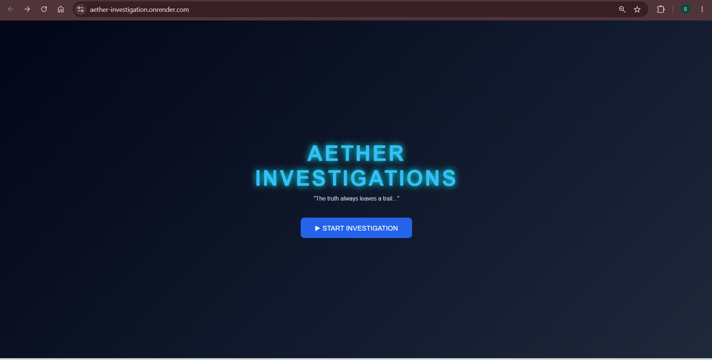
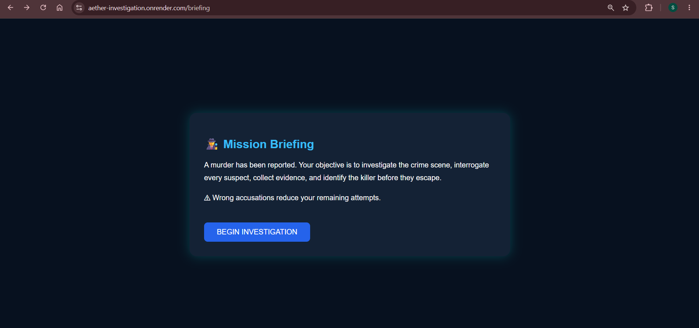
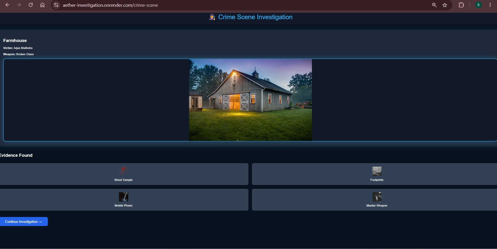
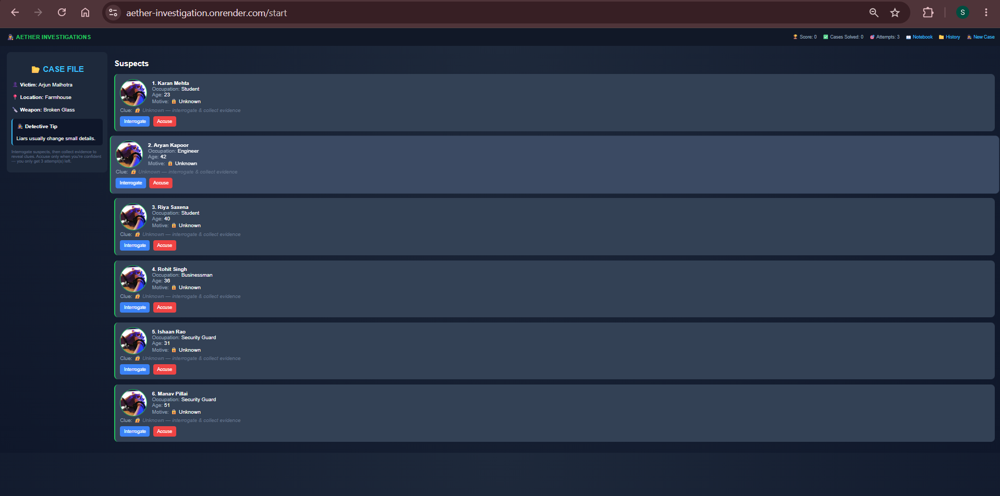
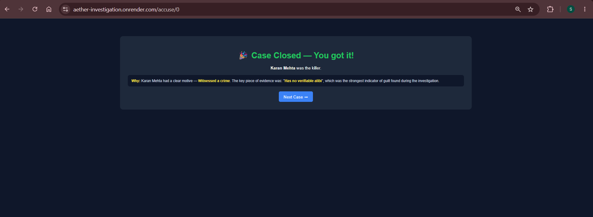

# 🕵️ Aether Investigations

A browser-based detective investigation game built using **Python**, **Flask**, **HTML**, **CSS**, and **JavaScript**. In every game, players investigate a randomly generated murder case by examining the crime scene, interrogating suspects, collecting evidence, and identifying the killer.

## 🌐 Live Demo

🔗 https://aether-investigation.onrender.com

---

## 📸 Screenshots

### Landing Page


### Mission Briefing


### Crime Scene


### Investigation Board


### Result Page


---

## ✨ Features

- 🎲 Randomly generated murder cases
- 🕵️ Multiple suspects with unique motives and clues
- 🧾 Evidence collection system
- 💬 Suspect interrogation
- 📖 Investigation notebook
- 📁 Case history tracking
- 🏆 Score and solved case counter
- 🖼️ Crime scene and evidence images
- 🌐 Fully deployed web application

---

## 🛠️ Technologies Used

- Python
- Flask
- HTML5
- CSS3
- JavaScript
- Jinja2
- Git & GitHub
- Render

---

## 📂 Project Structure

```
Aether_Investigation/
│
├── app.py
├── data.py
├── requirements.txt
├── README.md
│
├── static/
│   ├── images/
│   ├── css/
│   └── js/
│
├── templates/
│
└── screenshots/
```

---

## 🚀 How to Run Locally

1. Clone the repository

```bash
git clone https://github.com/shwetapatil0171/Aether_Investigation.git
```

2. Install dependencies

```bash
pip install -r requirements.txt
```

3. Run the application

```bash
python app.py
```

4. Open your browser and visit:

```
http://127.0.0.1:5000
```

---

## 🔮 Future Improvements

- More crime locations
- Additional suspects and evidence
- Difficulty levels
- Sound effects and background music
- Save game progress
- Leaderboard

---

## 👩‍💻 Author

**Shweta Patil**

First-Year Engineering Student

Built as a learning project to explore web development with Flask and create an interactive detective game.